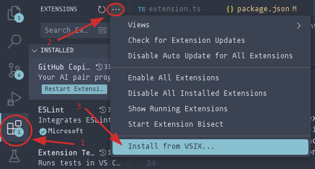

# Development

This document describes the intricacies of Nobl9 VSCode extension development workflow.
If you see anything missing, feel free to contribute :)

## Running extension

### In the project

1. Launch the project in VSCode, press Ctrl+Shift+B,
this will build the project and watch for changes.
2. Press Ctrl+Shift+D to open _Run and Debug_ screen.
3. Select and press _Run Extension_ from the dropdown at the left top corner.
4. New VSCode window should be spawned with the extension loaded inside.

### Packaging

Instead of running the extension from this project you can also choose to
package it and use it in any of the VSCode projects you want to or send the
packaged extension to someone else.

Run:

```bash
yarn run package
# OR:
yarn run vsce package
```

This will first bundle the extension with `esbuild` and create a minified
JS file under `./dist/extension.js`.
This bundled file is than packaged by [vsce](https://github.com/microsoft/vscode-vsce)
which is the VSCode extension manager.

The result is a single file with `.vsix` extension,
for instance: `nobl9-0.1.0.vsix`.

To install a .vsix file in VS Code:

1. Go to the Extensions view.
2. Select Views and More Actions.
3. Select Install from VSIX.



From the command line:

```bash
code --install-extension nobl9-0.1.0.vsix
```

## Pull requests

[Pull request template](../.github/pull_request_template.md)
is provided when you create new PR.
Section worth noting and getting familiar with is located under
`## Release Notes` header.

## Yarn

Run `yarn run` to display short description for each script.
If you're missing dependencies or they are out of date, make sure to run
`yarn install` first.

## CI

Continuous integration pipelines utilize the same yarn scripts which
you run locally. This ensures consistent behavior of the executed checks
and makes local debugging easier.

## Testing

### VSCode integration tests

The repository has integration tests with Visual Studio Code,
run via [vscode-test](https://github.com/microsoft/vscode-test) library.
These tests spawn a headless VSCode instance and run on it.
For more details read
[this](https://code.visualstudio.com/api/working-with-extensions/testing-extension).

The headless VSCode instance is downloaded automatically
by the testing library. If you're on an OS which might have problems with
required, linked libraries, there's a Nix shell and direnv integration
ready to use.

## Releases

Refer to [RELEASE.md](./RELEASE.md) for more information on release process.

## Dependencies

Renovate is configured to automatically merge minor and patch updates.
For major versions, which sadly includes GitHub Actions, manual approval
is required.
